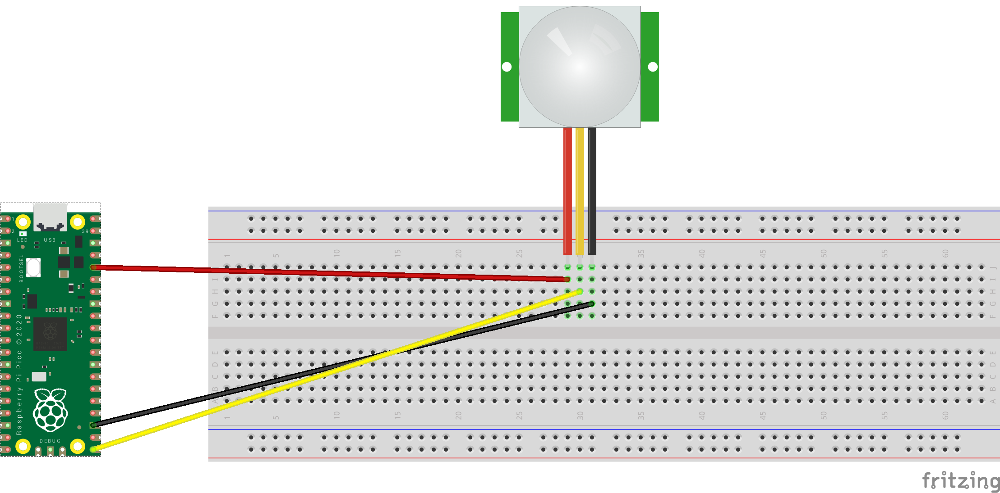

This program is using the Raspberry Pi Pico to gather data using a simple PIR sensor

It requires only 3 points of interconnect between the Pico and the PIR.

Please remove the plastic shield to see the pin labels.

Connect the Pico's GP16 to PIR sensor's OUT pin.

Connect the Pico's 3.3V Pin to PIR sensor's OUT pin.

Connect the Pico's GND pin to PIR sensor's GND pin.

Please note to create a data.txt file manually on the Pico prior to running the program the first time.

pico_pir.py is the main python program.

pico_pir_sensor.fzz is the Fritzing diagram. See https://fritzing.org/

pico_pir_sensor_bb.png is the wiring diagram below:

